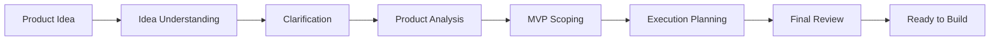

# idea-launch

**AI Product Planning Workspace for Independent Builders**

独立开发立项助手，把一个模糊的产品想法逐步转化为可以开始开发的执行方案。内置 Provider-agnostic 多模型运行时，默认使用火山方舟豆包 Seed 2.1 Pro，也支持 OpenAI、Anthropic、Google Gemini 与自定义 OpenAI 兼容服务。

**[在线体验](https://idea.kaminono.com)**：https://idea.kaminono.com

> Source-available for non-commercial use. 源码开放，供个人学习、研究和其他非商业用途使用。

[](LICENSE)

## idea-launch 是什么

独立开发者通常并不缺产品想法。真正困难的是在开始写代码以前确认：用户是谁、核心问题是什么、哪些信息还没有确定、第一版应该做什么、哪些功能现在不应该做、产品如何转化为真正的开发任务、前后方案有没有范围回流或事实漂移。

idea-launch 把这个过程拆成一条连续的大模型工作流。每个阶段有独立的输入、Prompt、结构化输出与运行时校验，而不是用一次超长 Prompt 生成一份无法落地的文档。

它不是聊天机器人，而是一个 Product Workspace：你看到的是结构化、可扫描、可以逐阶段推进的立项工件。

## 在线体验

地址：[https://idea.kaminono.com](https://idea.kaminono.com)

1. 打开右上角「设置」
2. 选择一个模型 Provider（默认火山方舟 / 豆包；也支持 OpenAI、Anthropic、Gemini、自定义 OpenAI 兼容服务），填写你自己的 API Key 与模型 ID
3. 点击「测试连接」确认可达性、Key、模型与结构化能力均正常
4. 在首页输入一个产品想法（或点击一个产品想法模板快速开始）
5. 点击「开始分析」，按工作流逐步推进

当前产品采用 BYOK（Bring Your Own Key）模式，用户使用自己的模型 API Key，按自己的模型用量计费。

## 工作原理



| 阶段 | 做什么 |
| --- | --- |
| Idea Understanding | 理解原始想法，提取已有信息、关键假设与信息缺口 |
| Clarification | 只在必要时提出 2 到 4 个高价值问题（最多 5 个，允许 0 个），再综合出 Clarified Context；提问与综合是两次独立的模型调用 |
| Product Analysis | 收敛产品定义、核心用户、核心场景、核心问题、替代方式、价值、关键假设与风险 |
| MVP Scoping | 主动帮你砍范围：第一版定义、唯一首要验证假设、最小完整用户闭环、必须做 / 暂缓做 / 明确不做 |
| Execution Planning | 把已冻结的 MVP 范围翻译成可开工的计划：产品结构、技术路径、数据对象、里程碑、任务、验证节点、立即行动项 |
| Final Review | 只读一致性审计，检查范围回流、事实漂移与执行准备度，输出 ready / needs_attention，不自动修改任何前序结果 |

后四个阶段都由你确认上一阶段结果后手动启动。每阶段产物写入本地项目，刷新页面直接展示，不会重新调用模型。

## 技术架构

Next.js App Router + React 19 + TypeScript（strict）+ Tailwind CSS v4，图标使用 lucide-react。

- 前端组件只调用本项目的 Next.js Route Handler，不直接发起第三方模型请求
- `app/api/ai/` 下的 Route Handler 只做校验、数据整理与转发，统一接收 `modelConfig`，不包含任何 Provider 判断分支
- 模型调用分层：业务客户端（`lib/ai/client.ts`）→ AI Runtime（`lib/ai/providers/runtime.ts`：能力包装、结构化守卫、最多一次修复）→ Provider Adapter（按 `openai-responses` / `openai-chat-completions` / `anthropic-messages` / `gemini-generate-content` 四种协议处理差异）
- Provider Registry（`lib/ai/providers/registry.ts`）统一描述内置 Provider：火山方舟（默认，豆包 Seed 2.1 Pro）、OpenAI、Anthropic、Google Gemini、自定义（OpenAI 兼容，Qwen / DeepSeek / Kimi 等均走此项）
- 结构化输出按 native / compatible / fallback 三级处理，响应一律在运行时按 `lib/ai/schemas.ts` 校验；错误归一化为统一七码
- Prompt、JSON Schema、运行时校验与错误归一化集中管理于 `lib/ai/`

## 本地运行

环境要求：Node.js 20.9.0 或更高版本。

```bash
npm install
npm run dev
```

打开 [http://localhost:3000](http://localhost:3000)，在设置中选择 Provider、填入 API Key 与模型 ID，测试连接通过后即可使用。

```bash
npm run build   # 生产构建
npm run lint    # 代码检查
```

## 数据与隐私

- 不需要账号，不需要注册
- 各 Provider 的 API Key 只保存在当前浏览器的 localStorage（Settings V2，按 Provider 独立存储），绝不进入项目数据
- 项目数据全部保存在当前浏览器本地，不使用云数据库，也没有服务端持久化
- 模型调用时，浏览器把本次请求所需的配置与 API Key 临时发送到应用的 Next.js Route Handler，由 Handler 转发到当前激活的 Provider；请求结束即释放，不写日志、不出现在错误信息中
- 自定义 Provider 的 Base URL 在服务端接受 SSRF 防护：仅允许 http(s)，拒绝回环 / 私网 / 链路本地 / 云 metadata 等内部地址，域名经 DNS 解析后再次校验
- 错误信息统一脱敏归一化（七码），不回显 Key、请求头、请求体或 Provider 原始错误全文
- 可以随时在设置或历史项目中清空全部本地数据（同时清理 Settings V1 / V2）

## 许可与使用

idea-launch 源码采用 **[PolyForm Noncommercial License 1.0.0](https://polyformproject.org/licenses/noncommercial/1.0.0)**（SPDX：`PolyForm-Noncommercial-1.0.0`）提供，完整正文见 [LICENSE](LICENSE)。

你可以将源码用于个人学习、研究、实验、非商业项目以及许可证允许的其他非商业用途。

**未经版权方另行书面授权，不允许将本项目或其修改版本用于商业用途。** 商业用途包括但不限于：

- 直接销售本项目或其修改版本
- 将本项目作为付费 SaaS 或商业服务提供
- 将本项目集成到收费产品或商业解决方案中
- 基于本项目源码提供收费部署、托管或定制服务
- 以其他以商业收益为目的的方式使用本项目

如果你希望将 idea-launch 用于商业项目，请先取得版权方单独的书面授权。当前仓库未公开商业合作联系方式。

以上为面向普通读者的通俗摘要，真正的许可范围以 [LICENSE](LICENSE) 中的 PolyForm Noncommercial License 1.0.0 正文为准。

> 项目使用的第三方依赖（Next.js、React、Tailwind CSS、lucide-react 等 npm 依赖）、字体和其他第三方资源，仍分别遵循其自身许可证，不因本项目许可证而改变。

## 文档

- [01-product-spec.md](docs/01-product-spec.md)：产品规格
- [02-user-flow.md](docs/02-user-flow.md)：用户流程
- [03-ai-workflow.md](docs/03-ai-workflow.md)：AI 工作流契约
- [04-data-schema.md](docs/04-data-schema.md)：数据结构
- [05-ui-design-system.md](docs/05-ui-design-system.md)：视觉设计系统
